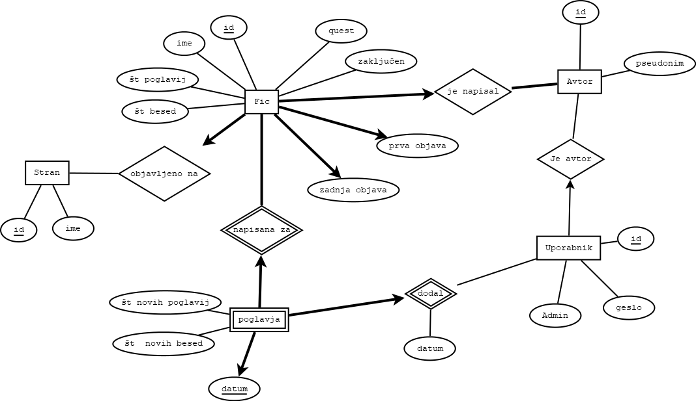

# Worm-fanfics
Projekt osnove Podatkovnih Baz

## Ideja:

[Worm](https://parahumans.wordpress.com/) je speltni roman avtorja John C. McCrae, pod psevdonimom Wildbow.

Kot zgodba o super močeh, s simpatetično glavno junakinjo, je zgodba na spletu postala zelo [popularna](https://en.wikipedia.org/wiki/Worm_(web_serial)).

Kakor z vsako drugo popularno zgodbo, so tudi za Worm ljubitelji kmalu začeli pisati svoje lastne zgodbe - Fanfictione oz fice.

## Ideja za Aplikacijo:

Narediti podatkovno bazo za fanfice, ki omogoča iskanje po naslovih, avtorjih, straneh na katerih so,... Dodatno lahko za vsak fic gledamo tudi po poglavjih, da vidimo kdaj so se posamezni fici pisali.

Dodajamo lahko poglavja, ki se avtomatsko prištejejo svojim ficom, ali pa naredijo nov fic, če je to prvo poglavje.

- Opomba: to že obstaja: [Worm story search](https://wormstorysearch.com/)

## Podatki:

Podatke je zbral [u/iarna](https://www.reddit.com/user/iarna/), ki je na [r/WormFanfic](https://www.reddit.com/r/WormFanfic/) več let vodil evidenco fanficov.

Podatki pobrani s strani: https://shared.by.re-becca.org/misc/worm

Podatki so bili pridobljeni in obdelani v okviru [projektne naloge za Programiranje 1](https://github.com/GalKuhar/Worm).

## ER diagram:

## Dodatno:

Osebno je Worm ena mojih najljubših zgodb, in jo toplo priporočam vsem, če imate čas.

Osebno bi opisal kot: Worm je za Spidermana to, kar je Pesem Ledu in Ognja (Igra prestolov) za Gospodarja Prstanov.

Če komu ni do branja, obstaja fanmade [audiobook](http://audioworm.rein-online.org/), če pa koga zanima literarna analiza, pa zelo priporočam [We've got worm podcast](https://www.doofmedia.com/weve-got-worm/) ([dostopen tudi na youtube](https://www.youtube.com/watch?v=4HydKjQMzJ8&list=PLCW6KR4MVOXaGS2KlDJzWITG0RzAJ9NLo)), kjer greta dva bralca, prvi, ki zgodbo bere prvič in drugi, ki jo je že prebral čez celo zgodbo po poglavjih, in jih nato analizirata.
